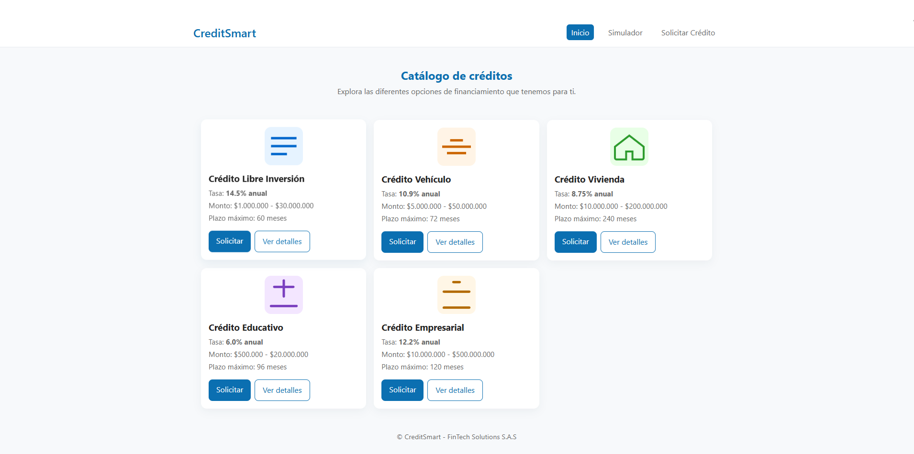
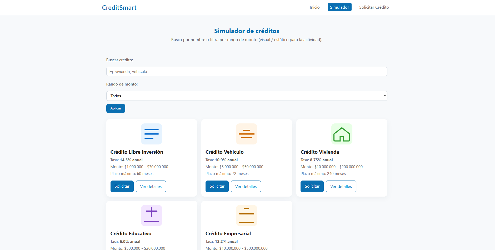
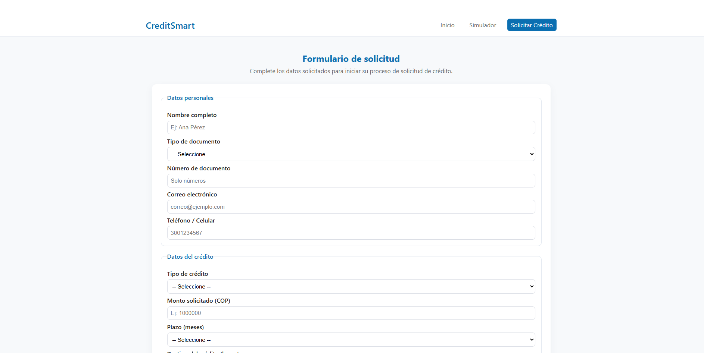

# Sistema Web de Gestión de Solicitudes de Crédito

**Nombre del estudiante:** Andres Camilo Lezcano
**Curso:** Diseño de Interfaces Web  
**Actividad:** Aplicar conceptos fundamentales de HTML5, CSS3 y diseño responsive  

---

## 📘 Descripción del proyecto
Este proyecto consiste en el desarrollo de la interfaz de usuario para un sistema web de gestión de solicitudes de crédito.  
Se aplican los conceptos fundamentales de **HTML5**, **CSS3** y **diseño responsive**, siguiendo buenas prácticas de maquetación, estructura semántica y estilo profesional.

El sistema está compuesto por tres páginas principales:

1. **Página Principal (index.html):** muestra el catálogo de créditos disponibles.  
2. **Página Simulador (simulador.html):** permite buscar o filtrar tipos de crédito.  
3. **Página Solicitar Crédito (solicitar.html):** formulario para que el usuario ingrese sus datos y solicite un crédito.

---

## 🧩 Estructura de archivos
/credit-smart/
├── index.html → Página principal (Catálogo de créditos)
├── simulador.html → Página del simulador / búsqueda
├── solicitar.html → Formulario de solicitud
├── styles.css → Hoja de estilos principal (CSS3, responsive)
├── README.md → Documentación del proyecto (este archivo)
└── .gitignore → (opcional) archivos a ignorar en Git

## 💻 Tecnologías utilizadas

- **HTML5** (estructura semántica: header, nav, main, section, article, footer, fieldset, legend)  
- **CSS3** (variables, flexbox, grid, media queries, sombras y transiciones)  
- **Responsive design** (adaptación para desktop, tablet y móvil)  
- **Opcional:** compatible con frameworks (Bootstrap / Tailwind) si se desea ampliar

---

## 🚀 Instrucciones para ejecutar el proyecto (3 opciones)

### Opción A — Abrir localmente (más simple)
1. Navega a la carpeta del proyecto `credit-smart`.
2. Haz doble clic en `index.html` o clic derecho → **Abrir con** → tu navegador (Chrome, Edge, Firefox).

### Opción B — Usando Live Server (Visual Studio Code)
1. Abre la carpeta en VS Code.
2. Instala la extensión **Live Server** si no la tienes.
3. Haz clic derecho en `index.html` → **Open with Live Server**.
4. Se abrirá `http://127.0.0.1:5500/index.html` (o similar).

### 📷 Capturas de pantalla







### Opción C — Servidor HTTP simple (Python)
Desde la carpeta del proyecto ejecuta en terminal:

- Python 3:
```bash
python -m http.server 5500